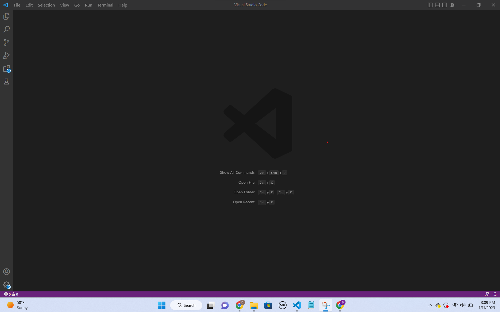
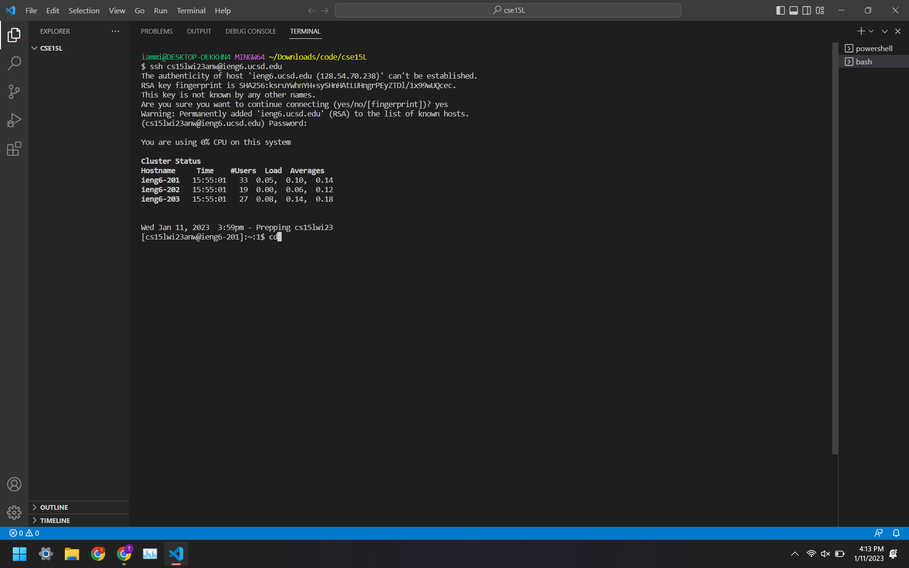
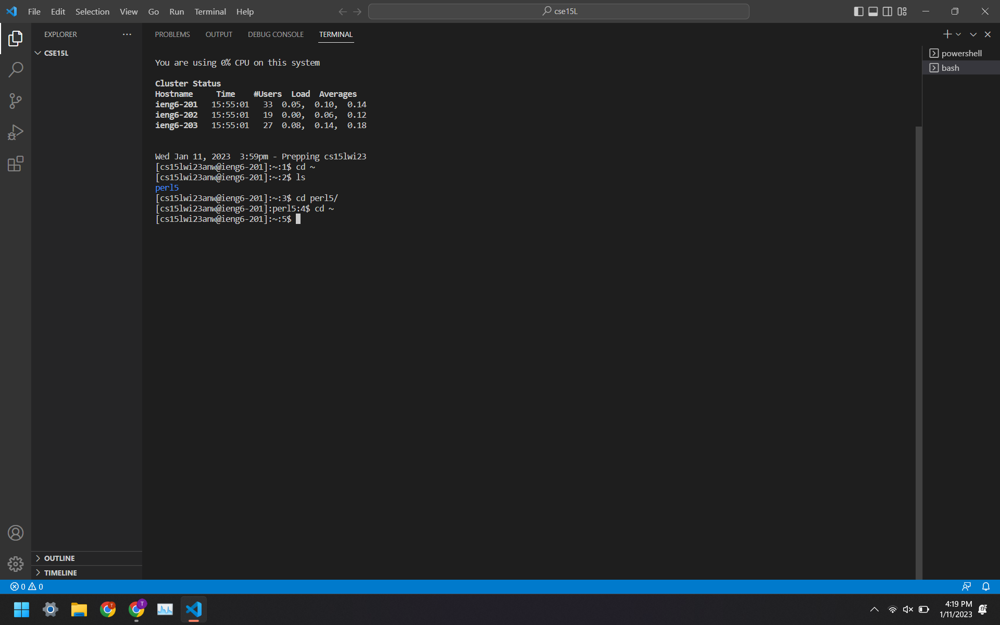

# How to remote acess?
**Install VScode**  
You need to go to [link]( https://code.visualstudio.com/) to down load VScode    
Follow the steps there, when finnished, your VScode should look like this:     


**Remote acess**  
To remote acess, you need to install git (for Windows) at [Link](https://gitforwindows.org/)   
Then you need to open a terminal and enter the following comand with the zz replaced by the letters in your course-specific account.     
`$ ssh cs15lwi23zz@ieng6.ucsd.edu`     
If you are met with the message:      
```
⤇ ssh cs15lwi23zz@ieng6.ucsd.edu     
The authenticity of host 'ieng6.ucsd.edu (128.54.70.227)' can't be established.     
RSA key fingerprint is SHA256:ksruYwhnYH+sySHnHAtLUHngrPEyZTDl/1x99wUQcec.      
Are you sure you want to continue connecting (yes/no/[fingerprint])?      
```     
Enter yes and keep going.     
When you are asked for a password, enter your password.    
When done, your page should look something like this:      



**Run some commands**     
Here are some comands you should consider running:       
cd ~      

cd      

ls -lat      

ls -a      

ls <directory> where <directory> is /home/linux/ieng6/cs15lwi23/cs15lwi23abc, where the abc is one of the other group members’ username      
  
cp /home/linux/ieng6/cs15lwi23/public/hello.txt ~/      
  
cat /home/linux/ieng6/cs15lwi23/public/hello.txt          
     

Here is an example of the comand cd ~ being used:       

  
  
  
In the example, I went to another directory and use cd ~ to take me back to my home directory      
good luck and have fun!

