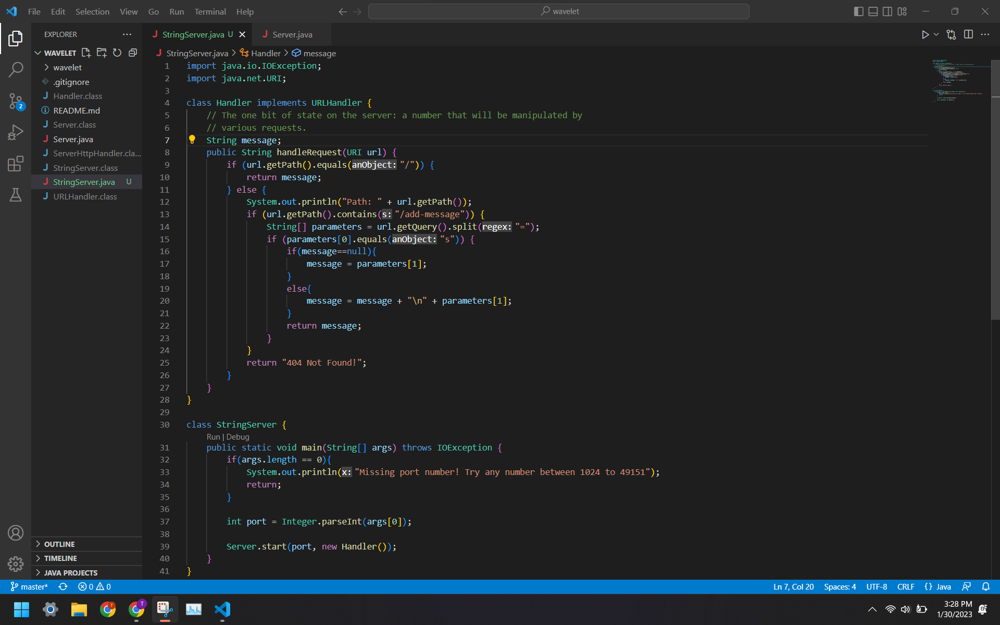
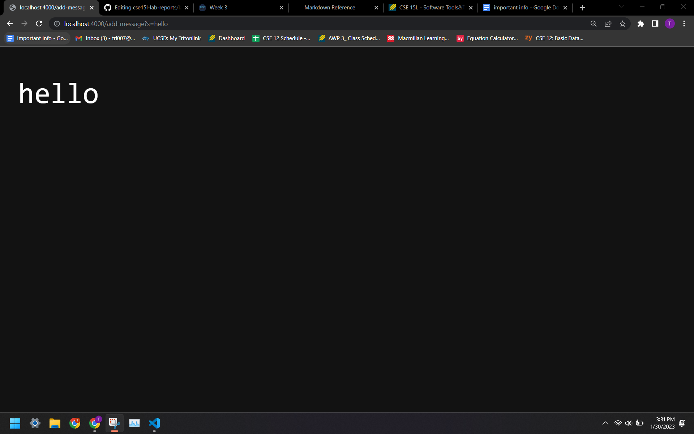
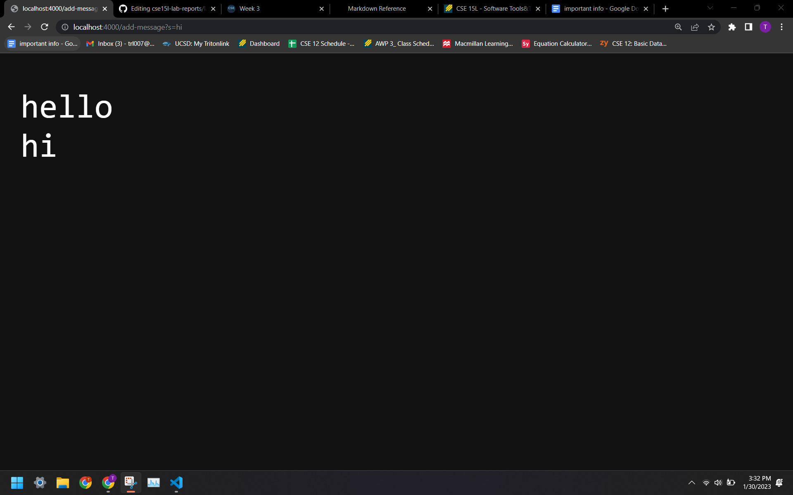

# Lab Report 2     

## Part 1         
This is my code for **StringServer**:             
             
        
This is an example of when I used /add-message:               
               
Initially, **StringServer** runs its **main** method, which ask for the port number (4000) and pass it on to **Server's start** method along with a newly created **Handeler** object.   
**Server's start** method calls **Handler's handle** method to display and update the page.      
The **handle** method gets the URL's path and do different things based on the result.       
In the example, the path contains "/add-message" and its query has "s=hello" so it update the String **message** by adding "hello" on the next line.      
The String **message** is then displayed by **Server's start** method.      

             
This is another example of when I used /add-message:               
                 
Initially, **StringServer** runs its **main** method, which ask for the port number (4000) and pass it on to **Server's start** method along with a newly created **Handeler** object.   
**Server's start** method calls **Handler's handle** method to display and update the page.      
The **handle** method gets the URL's path and do different things based on the result.       
In the example, the path contains "/add-message" and its query has "s=hi" so it update the String **message** by adding "hi" on the next line.      
The String **message** is then displayed by **Server's start** method.       
                         
                         
## Part 2       
The bug I chose is the reverse method. Instead of returning the given array in reverse order, the reverse method returns an array of zero's in the size of the given array.             
* A failure-inducing input for the buggy program, as a JUnit test and any associated code (write it as a code block in Markdown)          
  
```
@Test
  public void testReversed2() {
    int[] input1 = {1, 2};
    ArrayExamples.reversed(input1);
    assertArrayEquals(new int[]{2, 1}, ArrayExamples.reversed(input1));
  }
```
                
* An input that doesn’t induce a failure, as a JUnit test and any associated code (write it as a code block in Markdown)          
  
                   
* The symptom, as the output of running the tests (provide it as a screenshot of running JUnit with at least the two inputs above)          
           
          
* The bug, as the before-and-after code change required to fix it (as two code blocks in Markdown)           
             
