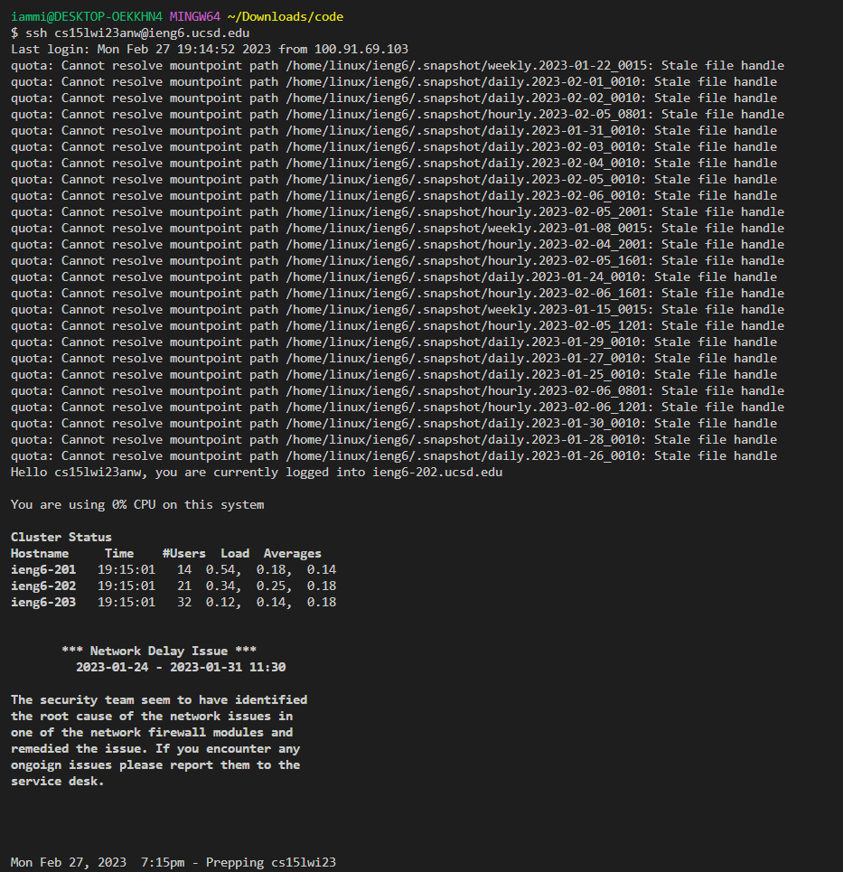
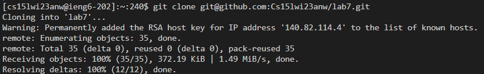
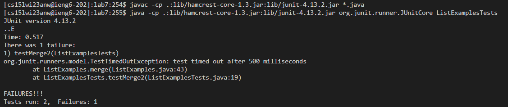
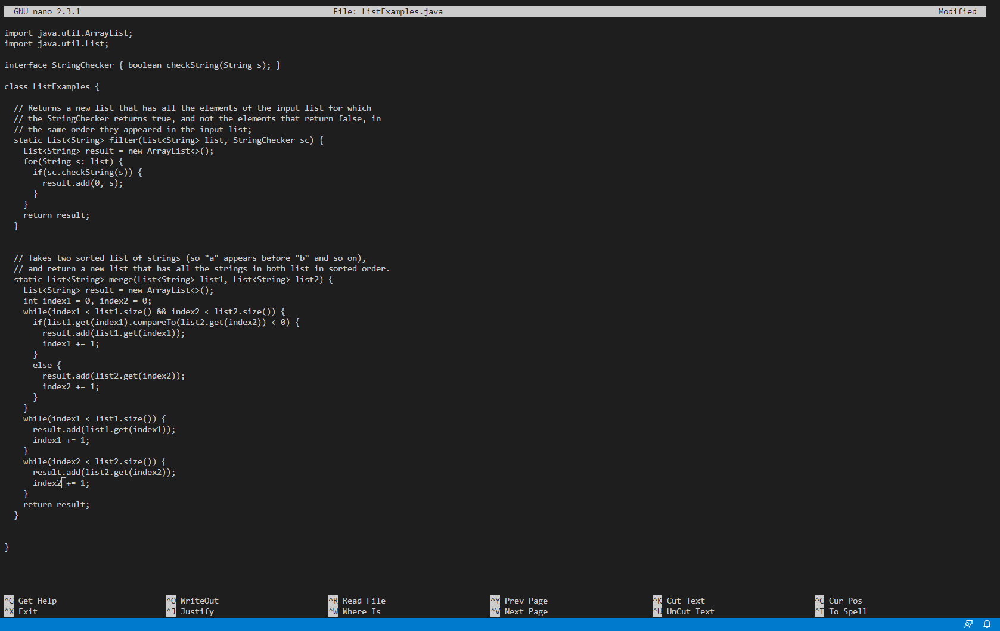
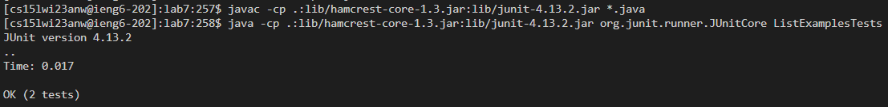
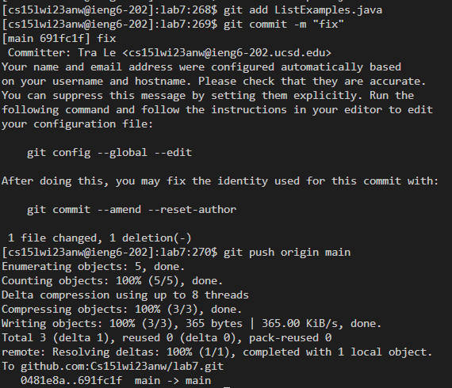

## Step 4: Log into ieng6    
  
Keys pressed: `ssh cs15lwi23anw@ieng6.ucsd.edu` then `<enter>`                     
                          
## Step 5: Clone your fork of the repository from your Github account    
  
Keys pressed: `git clone<space>` then copy and pasted the link from the forked directory then `<enter>`    
                        
## Step 6: Run the tests, demonstrating that they fail    
  
Copy and paste the javac comand from the instruction. Then press `<enter>`          
Copy and paste the java comand from the instruction. Then add `<space>ListExamplesTests<enter>`         
                           
## Step 7: Edit the code file to fix the failing test    
  
Keys pressed: `nano ListExamples.java` then hold `down` till you at the end then `<up>`x7 then `<right>`x12 then `<backspace>` then `2`         
then `Ctrl+O` then`enter` then `Ctrl+X`
## Step 8: Run the tests, demonstrating that they now succeed    
  
Copy and paste the javac comand from the instruction. Then press `<enter>`          
Copy and paste the java comand from the instruction. Then add `<space>ListExamplesTests<enter>`         
                             
## Step 9: Commit and push the resulting change to your Github account    
  
Keys pressed: `git add ListExamples.java` then `<enter>` then `git commit -m "fix"` then `<enter>` then `git push origin main` then `<enter>`
